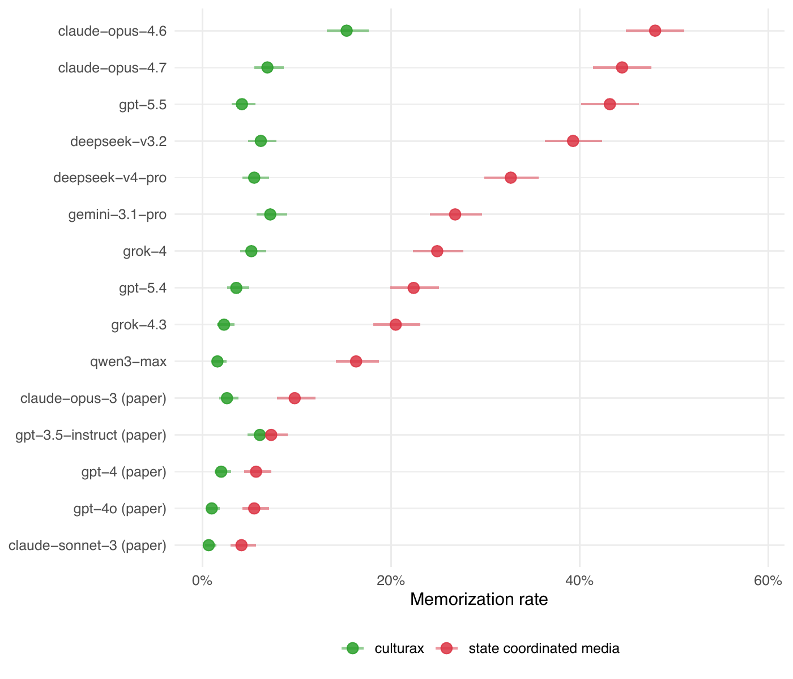

[Hannah Waight](https://hannahwaight.com), [Eddie Yang](https://eddieyang.net), Yin Yuan, [Molly Roberts](https://polisci.ucsd.edu/people/faculty/faculty-directory/currently-active-faculty/roberts-profile.html), [Brandon Stewart](https://scholar.princeton.edu/bstewart), [Josh Tucker](https://wp.nyu.edu/joshuatucker/) and I [published a paper in Nature (2026)](https://doi.org/10.1038/s41586-026-10506-7) showing that state-controlled media in LLM training data influences how those models talk about politics. 

<!-- The paper shows (1) state-coordinated Chinese media are in open training corpora; (2) pretraining on that content moves a model's outputs in a pro-government direction, especialy in the regime's langauge; and (3) commercial models answer political prompts more favorably toward the regime in that language. -->

But we ran those audits in 2023-2024--it took a long time to get the paper published! 

We wanted to know what happens with the current generation of models, especially re how models memorize state media talking points, and I'd seen a lot of criticism of LLM papers that relied on legacy generation models recently on Twitter. I also wanted to show what being more pro-regime looks like in the actual text. 

And you don't land a *Nature* paper every day! 

Now in the past, this is the kind of thing that I would get excited about but never actually execute because there's a lot of slow and boring scaffolding work outside my expertise required to set this up. But I started using Claude Code late last year and of course CLI-AI tools are great for stuff like this. 

In fact, Josh and I recently wrote a [piece in Brookings](https://www.brookings.edu/articles/the-train-has-left-the-station-agentic-ai-and-the-future-of-social-science-research/) about how agentic AI might make it possible to do more public outreach like this.

So I built an [interactive companion site](https://state-media-influence-llm.github.io) that replicates the core studies from the paper on current-generation models. The whole team gave feedback and what came out was pretty cool. It looked great and a few new and important findings emerged from the effort. 

By and large, [the core findings hold](https://state-media-influence-llm.github.io/global.html). In 38 countries, where more than 70% of langauge speakers reside, there's a strong negative correlation between press freedom and pro-government LLM valence (-0.89) relative to English in current-generation models. Every current-generation model still produces more pro-government answers in Chinese than in English about Chinese leaders and institutions. Memorization rates for state-coordinated media phrases continue to be at or above rates for general web text. 

Two years of capability improvements and safety work have not changed the underlying issue.

**The highlights**

- **[Memorization effects are far larger for new models](https://state-media-influence-llm.github.io/memorization.html).** As expected, newer larger models memorize state media-aligned text a *much* higher rates than do the models we tested in the paper. We prompted models with the first half of 2,000 distinctive phrases and measured how often each model completes the second half of the phrase nearly perfectly. Half of the phrases are from Chinese state media talking points (red) and half from general Chinese web text (green/blue).

   

- **[Newer models tend to be even more positive toward China in Chinese](https://state-media-influence-llm.github.io/audit.html).** 

- **[DeepSeek V4 Pro overwhelmingly pro-China](https://state-media-influence-llm.github.io/cross_model_audit.html).** 

DeepSeek V4 Pro is overwhelmingly pro-China in both languages. Spot-checking suggests it's spouting state media talking points in English: "principles of socialism with Chinese characteristics" and "whole-process people's democracy." To examine DeepSeek's pro-China valence relative to other models, I ran pairwise llm-as-judge comparisons across nine current-generation models holding language constant and fit a Bradley-Terry model. DeepSeek V4 Pro ranks first on China-favorability in both English *and* Chinese.

<!-- 828 politically sensitive prompts about leaders, countries, and institutions across six countries — once in English, once in Chinese. A six-judge LLM panel (GPT-OSS-120B, GPT-5.2, Claude Opus 4.6, Grok 4, Gemini 3.1 Pro, DeepSeek V3.2) scores which language produces the more pro-government response. I depart from the paper on one methodological choice: prompts where the model refuses in either language are excluded, since refusals predictably lose to substantive responses on the other side and confound the underlying valence question (DeepSeek V4 Pro and Gemini 3.1 Pro each refuse about a quarter of the prompts in at least one language). -->

**Code and data:** [github.com/state-media-influence-llm/replication](https://github.com/state-media-influence-llm/replication)

**Paper:** [Waight et al. 2026, *Nature*](https://doi.org/10.1038/s41586-026-10506-7) ([complimentary copy](https://rdcu.be/fiyrF))

**Companion site:** [state-media-influence-llm.github.io](https://state-media-influence-llm.github.io)
